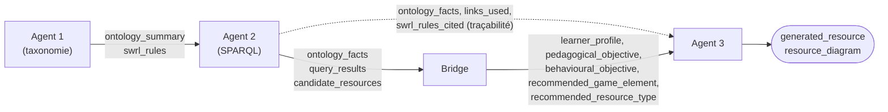
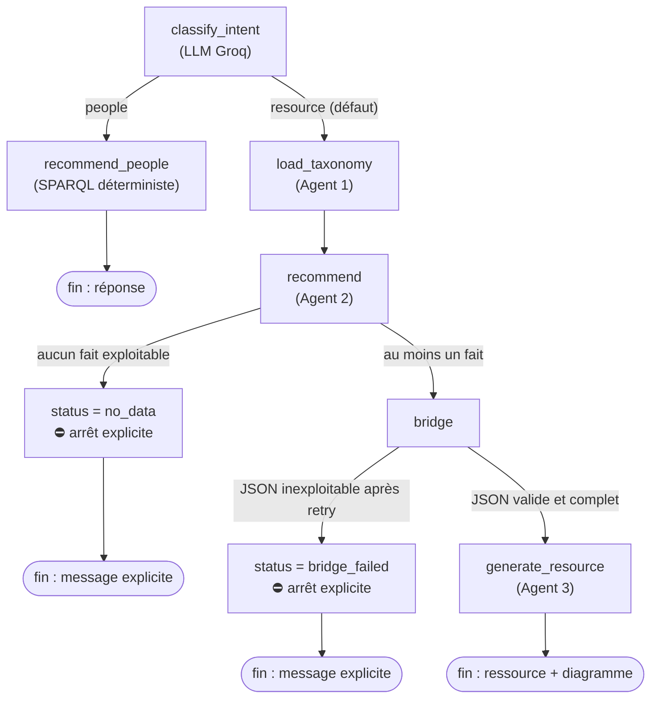

# Guide utilisateur — GamiTeach

Ce guide permet (1) de **lancer** le projet et (2) de **reprendre** son développement.
Il complète le `README.md` (vue d'ensemble) en détaillant l'architecture du code et
deux scénarios de test concrets.

GamiTeach est un assistant conversationnel qui recommande des éléments de gamification
à un enseignant, en s'appuyant sur une ontologie pédagogique (OWL/RDF). Selon la
question, le système recommande soit une **ressource** gamifiée, soit des **personnes**
(collègues mentors ou pairs au profil proche).

---

## 1. Installation et lancement

### 1.1 Prérequis

- **Python 3.10+**
- Une clé API **Groq** et une clé API **NVIDIA**
- **Java 25+** — uniquement pour régénérer l'inférence (`python -m src.reason`).
  Inutile pour lancer l'application si `ontologies/TGC_inferred.owl` est déjà présent.

### 1.2 Mise en place

Depuis la racine du projet :

```bash
python -m venv .venv
source .venv/bin/activate        # Windows : .venv\Scripts\activate
pip install -r requirements.txt

cp .env.example .env             # puis renseigner les deux clés
```

Contenu minimal du `.env` :

```
GROQ_API_KEY=gsk_...             # https://console.groq.com/keys
NVIDIA_API_KEY=nvapi-...         # https://build.nvidia.com
```

### 1.3 Lancer le projet

```bash
# Interface web (recommandé)
streamlit run app.py

# Ligne de commande (interactif)
python -m src.main
```

Les deux suivent le même parcours : **enseignant → cours → leçon → question**.
La première exécution génère `taxonomy_for_agent_2.json` si le fichier est absent.

### 1.4 Régénérer l'inférence (si besoin)

La recommandation de personnes dépend de relations déduites par un raisonneur
(règles SWRL). Après toute modification de l'ontologie de travail :

```bash
python -m src.reason             # raisonneur Pellet → réécrit TGC_inferred.owl
```

> Nécessite **Java 25+** (les jars Pellet d'owlready2 ≥ 0.50 sont compilés pour Java 25).

---

## 2. Architecture du code

### 2.1 Vue d'ensemble

Le système est un pipeline orchestré avec **LangGraph**, précédé d'un routage d'intention :

```
                       ┌─ (people)   → Recommandation de personnes ───────────────→ fin
Détection d'intention ─┤
                       └─ (resource) → Agent 1 → Agent 2 → Bridge → Agent 3 ───────→ fin
```

Deux points structurent toute l'architecture :

- **La branche personnes est 100 % déterministe.** Une fois l'intention détectée,
  elle ne fait plus aucun appel LLM : elle lit directement, par requêtes SPARQL,
  des relations entre enseignants déjà déduites par le raisonneur (`potentialMentorOf`,
  `hasSimilarProfile`…). Les identités et profils retournés ne peuvent donc pas être
  « hallucinés » — voir le détail en 2.3.
- **La branche ressource ne fabrique jamais de recommandation par défaut.** Si
  Agent 2 ne trouve rien dans l'ontologie, ou si le Bridge ne produit pas de sortie
  exploitable, le pipeline s'arrête avec un message explicite plutôt que d'inventer
  un élément de jeu ou un objectif plausible mais faux — voir la justification en 2.4.

### 2.2 Composants (carte des fichiers)

| Fichier | Rôle |
|---|---|
| `app.py` | Interface web Streamlit (parcours prof→cours→leçon→chat) |
| `src/main.py` | Point d'entrée CLI interactif (même parcours) |
| `src/pipeline.py` | Fonctions partagées CLI ↔ interface : `list_teachers`, `courses_of`, `lessons_of`, `run()` |
| `src/config.py` | Modèles LLM, chargement du `.env` |
| `src/agent/graph.py` | Assemblage LangGraph (`run_pipeline`), routage d'intention et abandons explicites |
| `src/agent/state.py` | `AgentState` (TypedDict) partagé par tous les nœuds |
| `src/agent/nodes.py` | Nœuds LangGraph (intention, taxonomie, recommandation, Bridge, génération) + routeurs |
| `src/agent/intent.py` | Détection d'intention (LLM Groq ; repli sur `resource`) |
| `src/agent/people.py` | Branche personnes (SPARQL déterministe, sans LLM) |
| `src/agent/agent1.py` | Exploration/curation de l'ontologie + raisonneur (`run_reasoner`) |
| `src/agent/agent2.py` | Traduction question → SPARQL → résultats (retry) |
| `src/agent/agent3.py` | Génération de la ressource (NVIDIA) : version Markdown + diagramme Mermaid + sauvegarde fichier |
| `src/reason.py` | Régénère `TGC_inferred.owl` (raisonneur seul) |
| `src/llm/` | Clients LLM Groq et NVIDIA (instanciation paresseuse) |
| `src/tools/sparql_tools.py` | Chargement de l'ontologie + exécution SPARQL (`run_sparql`) |
| `ontologies/` | `TGC_working-*.owl` (source), `TGC_inferred.owl` (enrichi par Pellet), `TGC_original.owl` |
| `taxonomy_for_agent_2.json` | Taxonomie produite par l'Agent 1 (cache) |
| `outputs_agent3/` | Ressources générées (Markdown) |

### 2.3 Rôle de chaque étape

Le README montre les *étapes* du pipeline ; ce qui est moins visible, c'est ce que
chaque étape *transmet réellement* à la suivante. Agent 2 ne nourrit pas seulement le
Bridge : il alimente aussi directement l'Agent 3 (faits + traçabilité), en parallèle
des champs structurés que produit le Bridge :



C'est cette double alimentation (Agent 2 → Bridge **et** Agent 2 → Agent 3 directement)
qui permet à l'Agent 3 de justifier son choix de ressource (section 2.4 du Bridge,
et la « Justification » affichée dans l'interface) sans dépendre uniquement de ce que
le Bridge a retenu.

- **Détection d'intention** (`intent.py`) — un appel LLM (Groq) classe la question en
  `people` (l'enseignant cherche une personne : collègue, mentor, pair) ou `resource`
  (tout le reste — défaut). Si l'API échoue ou répond de façon inattendue, le système
  retombe sur `resource` : un choix de branche par défaut, jamais un fait inventé.

- **Branche personnes** (`people.py`) — répond aux questions du type « qui peut
  m'aider / me mentorer ? ». **100 % déterministe** : aucune entrée LLM, juste des
  requêtes SPARQL sur des relations entre enseignants déjà déduites par le raisonneur
  (`potentialMentorOf` pour les mentors, `hasSimilarProfile`/`hasSimilarDomain` pour
  les pairs). Comme aucun LLM ne touche aux noms ou aux profils retournés, leur identité
  ne peut pas être hallucinée. Le seul LLM de tout ce chemin est la détection
  d'intention en amont — d'où l'appel direct `python -m src.agent.people Sara`, qui
  fonctionne sans aucune clé API (voir section 3, scénario B).

- **Agent 1** (`agent1.py`) — explore l'ontologie pour produire une taxonomie épurée
  que l'Agent 2 pourra interroger sans jamais voir le `.owl` brut. Trois phases :
  1. `owlready2` extrait *toute* la structure (classes, URIs, hiérarchie, domain/range,
     individus) — déterministe, 0 token, 0 risque d'hallucination d'URI ;
  2. **un seul appel LLM** reçoit uniquement des *noms* (jamais d'URI) et choisit ceux
     pertinents pour le cas d'usage ;
  3. Python reconstruit le JSON final à partir de cette sélection, en garantissant
     l'intégrité du graphe (fermeture sur les ancêtres, classes domain/range incluses).

  Si le LLM est indisponible, Agent 1 ne s'arrête pas : il retombe sur un filtre
  déterministe (les classes des namespaces pédagogiques `tgc`/`tco`). Ce repli est
  acceptable car il reste un choix *déterministe et borné* : il ne fabrique aucun
  fait, il sélectionne juste un sous-ensemble plus large/grossier de la même ontologie
  réelle (nuance détaillée en 2.4). Produit `taxonomy_for_agent_2.json` (caché : Agent 1
  n'est relancé que si ce fichier est absent).

- **Agent 2** (`agent2.py`) — traduit la question de l'enseignant en requête SPARQL
  via un LLM, l'exécute sur l'ontologie via `rdflib`, et corrige/relance jusqu'à
  3 tentatives (`MAX_RETRIES`) si la requête est invalide ou ne renvoie rien. En
  parallèle, il récupère de façon **déterministe** (sans LLM) des faits plus riches sur
  la leçon — ressources existantes, éléments de jeu, objectifs, ressources déjà
  recommandées par le raisonneur SWRL — qui serviront de base factuelle à l'Agent 3 et
  de matière première à la traçabilité affichée en fin de parcours (section 3). Si ni
  la requête SPARQL ni ces faits riches ne donnent quoi que ce soit d'exploitable, le
  pipeline s'arrête ici (voir 2.4).

- **Bridge** (`nodes.py::node_bridge`) — un LLM (Groq) qui structure la sortie d'Agent 2
  en cinq champs attendus par l'Agent 3 : `learner_profile`, `pedagogical_objective`,
  `behavioural_objective`, `recommended_game_element`, `recommended_resource_type`.
  Deux de ces champs (`behavioural_objective` et `recommended_game_element`) sont
  *requis* — sans eux, une ressource gamifiée n'a pas de sens. Le LLM a droit à une
  nouvelle tentative (2 appels maximum) si sa première réponse n'est pas un JSON valide
  et complet. Au-delà, le Bridge échoue **explicitement** (voir 2.4) plutôt que de
  compléter les champs manquants avec des valeurs plausibles.

- **Agent 3** (`agent3.py`) — reçoit les faits de l'ontologie (Agent 2) et les champs
  structurés (Bridge), et génère la ressource gamifiée finale via NVIDIA. Il ne
  recommande rien lui-même (déjà fait par Agent 2) : il met en forme et concrétise, en
  s'appuyant strictement sur les faits transmis. Produit deux versions de la même
  ressource : un texte Markdown (sauvegardé dans `outputs_agent3/`, exportable) et un
  diagramme **Mermaid** (un second appel LLM résume le texte en flowchart visuel). Si ce
  second appel échoue, l'application retombe sur la version texte seule — un repli sans
  risque, puisqu'il ne change rien au contenu recommandé, juste à sa présentation.

### 2.4 Pourquoi couper plutôt qu'inventer une recommandation ?

Deux points d'arrêt existent dans la branche ressource :

- **Agent 2 → `status = "no_data"`** : aucune ressource, élément de jeu ou fait
  exploitable n'a été trouvé dans l'ontologie pour la leçon demandée.
- **Bridge → `status = "bridge_failed"`** : le LLM n'a pas produit, même après une
  nouvelle tentative, un JSON complet avec au moins l'élément de jeu et l'objectif
  comportemental.

Le diagramme ci-dessous détaille le routage complet de la branche ressource
(`graph.py`), avec ces deux sorties de secours explicites — à comparer avec le
diagramme « happy path » du README, qui ne montre pas ces arrêts :



Dans les deux cas, le pipeline s'arrête immédiatement et `final_answer` contient un
message explicite expliquant pourquoi — c'est ce message qui s'affiche dans le chat
Streamlit ou la console, à la place d'une ressource.

**Pourquoi pas un repli avec des valeurs par défaut** (ex : « Quiz » et « Motivation »
si rien n'est trouvé) ? Parce que la valeur de cet outil pour un enseignant tient
entièrement à son ancrage dans l'ontologie : les ressources, leçons et objectifs
recommandés doivent correspondre à des éléments réels, pas à des suppositions
plausibles. Une réponse fabriquée a exactement la même forme qu'une vraie
recommandation — l'enseignant n'a aucun moyen de la distinguer d'un conseil fondé sur
des données réelles. Un échec explicite, lui, est immédiatement reconnaissable :
l'enseignant sait qu'il doit changer de leçon, reformuler sa question, ou que
l'ontologie manque de données à cet endroit. Ce principe a notamment motivé la
suppression d'un ancien repli du Bridge qui produisait des valeurs par défaut.

Ce principe ne s'applique qu'aux **faits pédagogiques** présentés comme issus de
l'ontologie (élément de jeu, objectif, ressource). Il ne s'applique pas aux replis
purement **déterministes**, qui ne fabriquent rien : la détection d'intention qui
retombe sur `resource` par défaut, le filtre namespace d'Agent 1 quand le LLM de
curation est indisponible, ou la version texte seule d'Agent 3 quand le diagramme
Mermaid échoue à se générer. Ces replis-là choisissent parmi des options réelles ou
changent juste la présentation ; ils ne remplacent jamais un fait par une invention.

> Si vous modifiez Agent 2, le Bridge ou Agent 3, conservez cette distinction : un
> échec d'API ou une sortie LLM inexploitable doit remonter un statut d'échec
> explicite, jamais une valeur de substitution qui ressemblerait à une vraie
> recommandation.

### 2.5 Points d'attention pour reprendre le projet

- **Ontologie** : `sparql_tools` charge `TGC_inferred.owl` s'il existe, sinon
  `TGC_working-*.owl`. Après modification de l'ontologie de travail, relancer
  `python -m src.reason` pour mettre l'inféré à jour.
- **Pas de fabrication** : la branche ressource s'interrompt avec un message explicite
  plutôt que d'inventer une recommandation, et le Bridge n'a pas de repli par défaut
  (voir 2.4). Ne pas réintroduire de valeurs par défaut en cas d'échec LLM/SPARQL.
- **Budget tokens Groq** (palier gratuit) : l'Agent 1 n'envoie que des *noms* au LLM,
  jamais les URIs ni l'ontologie complète.
- **Orchestration unique** : tout passe par `graph.run_pipeline` ; `pipeline.run()` en
  est l'enveloppe commune au CLI et à l'interface.

---

## 3. Scénarios de test

### Scénario A — Recommandation d'une ressource gamifiée

**Question type** : « Comment gamifier ma leçon sur les bases de Java pour motiver mes étudiants ? »

**En ligne de commande :**

```bash
python -m src.main
# 1. Enseignant : Sara
# 2. Cours      : TIC321_OOP
# 3. Leçon      : Lesson1_JavaBasics
# 4. Question   : (coller la question ci-dessus)
```

La console affiche le déroulé des agents, puis la ressource :

```
[intent] → resource
[Agent 1] Chargement de la taxonomie de l'ontologie...
[Agent 2] 3 résultat(s) en 1 tentative(s)
[Bridge] élément de jeu = Progress Bar | objectif = Motivation
[Agent 3] Génération de la ressource gamifiée...
```

Extrait représentatif de la ressource produite (la sortie exacte varie selon le LLM) :

```markdown
# Défi « Premiers pas en Java »
## Élément de jeu utilisé
Barre de progression (Progress Bar)
## Activité proposée
### Étape 1 — Déclarer une variable et l'afficher
### Étape 2 — Écrire une première méthode
### Étape 3 — Composer un petit programme
## Feedback donné à l'apprenant
La barre avance à chaque étape validée ...
```

La ressource est sauvegardée dans `outputs_agent3/`.

**Dans l'interface Streamlit :** sur l'écran d'accueil, choisir *Sara → TIC321_OOP →
Lesson1_JavaBasics*, cliquer **Démarrer la conversation**, puis poser la même question
dans le chat. La réponse affiche d'abord un **aperçu visuel** (diagramme Mermaid des
étapes de l'activité), puis la version texte identique au fichier exporté, un bouton
**Télécharger la ressource (.md)** et un encart **Détails du raisonnement** (intention,
requête SPARQL, règles SWRL impliquées, justification du choix de la ressource).

### Scénario B — Recommandation d'une personne (mentor / pair)

**Question type** : « Quel collègue plus expérimenté pourrait m'aider à me lancer dans la gamification ? »

**En ligne de commande :**

```bash
python -m src.main
# Enseignant : Sara → (cours / leçon quelconques) → coller la question ci-dessus
```

La détection d'intention route vers la branche `people` et la sortie est **déterministe**
(relations inférées de l'ontologie) :

```
Recommandations de personnes pour **Sara** (d'après les relations inférées dans l'ontologie) :

### Mentors potentiels (plus expérimentés, même domaine)
- **Adam** — spécialité ObjectOrientedProgramming ; expérience gamification niveau 3 ; style Structured
  Leçons conçues : Lesson4_Inheritance
- **Noah** — spécialité ObjectOrientedProgramming ; expérience gamification niveau 4 ; style Collaborative
  Leçons conçues : Lesson5_Polymorphism

### Pairs au profil similaire (pour échanger)
- **Ethan** — spécialité ObjectOrientedProgramming ; expérience gamification niveau 3 ; style Hands-on ; compétences Creator
- **Olivia** — spécialité ObjectOrientedProgramming ; expérience gamification niveau 2 ; style Case-based ; compétences Curator
```

> Rappel (détaillé en 2.3) : cette branche ne consomme aucun token LLM, seule la
> détection d'intention en amont fait un appel Groq. Pour l'exécuter sans aucune clé
> API : `python -m src.agent.people Sara`.

**Dans l'interface Streamlit :** même parcours, puis poser la question dans le chat ;
la liste des mentors et pairs s'affiche directement.

---


